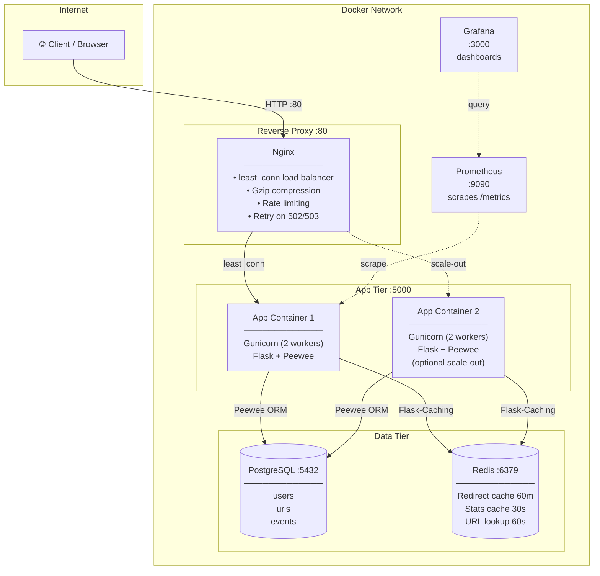

# Architecture

## Overview

The URL shortener is a stateless Flask application behind an Nginx reverse proxy, backed by PostgreSQL for persistence and Redis for caching. All components run as Docker containers orchestrated with Docker Compose.

---

## System Diagram



---

## Request Flow

### Short-code redirect (hot path)

```
Client
  │
  ▼ GET /<short_code>
Nginx  ─── rate limit: 60 req/min per IP ───►  429 if exceeded
  │
  ▼
Flask route: redirect_url()
  │
  ├─► Redis.get(short_code)  ──── HIT ────►  302 redirect (< 2 ms)
  │
  └─► MISS ──► PostgreSQL SELECT WHERE short_code = ?
                   │
                   ├─► Not found  ──►  404 {"error":"URL not found"}
                   ├─► is_active=false  ──►  404 {"error":"URL is inactive"}
                   └─► Found  ──►  Redis.set(short_code, 3600s)
                                    │
                                    ▼
                               Event.create(event_type="click")
                                    │
                                    ▼
                              302 redirect
```

### URL creation

```
Client
  │
  ▼ POST /api/urls  {original_url, user_id?, short_code?, title?}
Nginx  ─── rate limit: 10 req/min per IP ───►  429 if exceeded
  │
  ▼
Flask route: create_url()
  ├─► Validate body is a JSON object
  ├─► Validate original_url is http/https
  ├─► Validate user_id exists (if provided)
  ├─► Validate custom short_code (if provided)
  │
  └─► db.atomic():
        Url.create(short_code="__pending_<random>")
        url.short_code = custom_code OR to_base62(url.id)
        url.save()
        Event.create(event_type="created")
  │
  ▼
201 {"id":..., "short_code":..., ...}
```

---

## Component Responsibilities

### Nginx

- **Entry point** for all external traffic (port 80)
- **Load balancer**: `least_conn` distributes to all `app` containers discovered via Docker DNS (`resolver 127.0.0.11`)
- **Rate limiter**: 10 req/min on URL creation, 60 req/min on redirects (prevents abuse)
- **Compression**: gzip for JSON and HTML responses
- **Retry**: automatically routes to another app instance on `502`/`503`
- **Keepalive**: 32 persistent upstream connections (reduces TCP overhead)

### Flask App (Gunicorn)

- **Stateless**: no in-process state that cannot be lost. Any container can serve any request
- **ORM**: Peewee with `reuse_if_open=True` — one DB connection per worker, reused across requests
- **Caching**: Flask-Caching with Redis backend; falls back to `SimpleCache` if Redis is unreachable
- **Observability**: `prometheus-flask-exporter` auto-instruments all routes + exposes `/metrics`

### PostgreSQL

- **Single primary** on the same host (no replica in the 1 GB configuration)
- **Named volume** (`postgres_data`) — data persists across container restarts and image updates
- **Tuned for low RAM**: `shared_buffers=32MB`, `work_mem=4MB`, `max_connections=50`
- **Tables**: `users`, `urls`, `events`

### Redis

- **Cache** only — Redis is not the source of truth. All cached data can be reconstructed from PostgreSQL
- **Eviction**: `allkeys-lru` — oldest cached items evicted automatically when memory cap (64 MB) is reached
- **AOF persistence**: `appendonly yes` with `appendfsync everysec` — at most 1 second of cache data lost on crash
- **TTLs**: redirect targets: 3600s; URL objects: 60s; stats: 30s

---

## Data Model

```
┌─────────────────────┐       ┌────────────────────────────────┐
│ users               │       │ urls                           │
├─────────────────────┤       ├────────────────────────────────┤
│ id          SERIAL  │──┐    │ id           SERIAL            │
│ username    VARCHAR │  │    │ user_id      FK → users.id     │◄─┐
│ email       VARCHAR │  └───►│ short_code   VARCHAR(20) UNIQ  │  │
│ created_at  TIMESTAMP│      │ original_url TEXT              │  │
└─────────────────────┘       │ title        VARCHAR(255)      │  │
                              │ is_active    BOOLEAN           │  │
                              │ created_at   TIMESTAMP         │  │
                              │ updated_at   TIMESTAMP         │  │
                              └────────────────────────────────┘  │
                                                                   │
                              ┌────────────────────────────────┐  │
                              │ events                         │  │
                              ├────────────────────────────────┤  │
                              │ id          SERIAL             │  │
                              │ url_id      FK → urls.id  CASCADE│─┘
                              │ user_id     FK → users.id SET NULL│
                              │ event_type  VARCHAR(50)        │
                              │ timestamp   TIMESTAMP          │
                              │ details     TEXT (JSON)        │
                              └────────────────────────────────┘
```

**Key constraints:**
- `users.username` — UNIQUE
- `users.email` — UNIQUE
- `urls.short_code` — UNIQUE, max 20 chars
- `events.url_id` — CASCADE DELETE (deleting a URL removes its events)
- `events.user_id` — SET NULL on user delete (events are preserved)

---

## Port Map

| Port | Service | Exposed to host? |
|------|---------|-----------------|
| 80 | Nginx (public entry point) | ✅ Yes |
| 5000 | Gunicorn / Flask | ✅ Yes (dev); ❌ No (1GB prod) |
| 5432 | PostgreSQL | ✅ Yes (dev/debug) |
| 6379 | Redis | ✅ Yes (dev/debug) |
| 3000 | Grafana | Proxied via Nginx `/grafana/` |
| 9090 | Prometheus | Internal only |

---

## Scaling Model

| Dimension | Current | Max safe (1 GB droplet) |
|-----------|---------|------------------------|
| App containers | 1 | 2 (`--scale app=2`) |
| Gunicorn workers per container | 2 | 2 |
| Total concurrent request handlers | 2 | 4 |
| PostgreSQL connections | 50 max | 50 max |
| Redis memory | 64 MB | 64 MB |

See [capacity.md](capacity.md) for throughput numbers.
